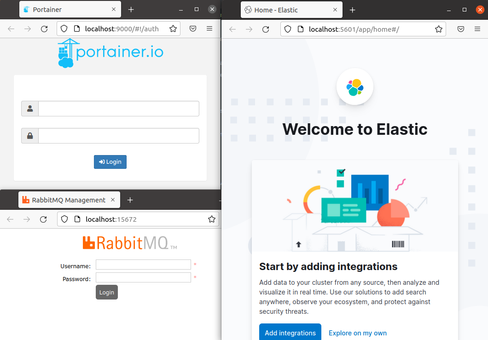
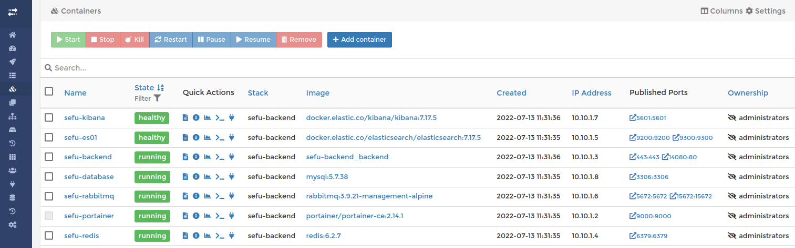
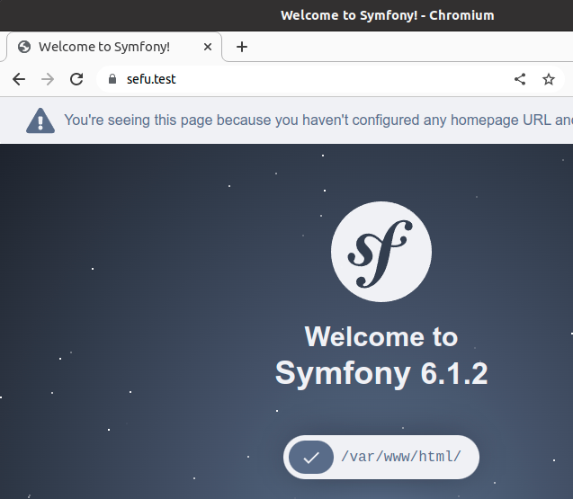

# Quick Start Backend

- Choose your custom domain `sefu.test` in :
  * Makefile
  * .docker/config/apache/000-default.conf
  * .docker/bin/generate_certs.sh
- make install
- docker-compose up -d
- make create.symfony.project

- Start to dev in html/src and enjoy :zany_face:

## Services

- Project : https://sefu.test (or your custom domain)
- Elastic : http://localhost:5601
- RabbitMq : http://localhost:15672
- Portainer : http://localhost:9000





## Features

- CA Certificate
- Ext-brotli
- Xdebug

## Docker Config

```shell
.
├── apache
│   ├── 000-default.conf
│   └── httpd.conf
├── elasticsearch
│   └── es01.yml
├── kibana
│   └── kibana.yml
├── mysql
│   └── conf-mysql.cnf
├── php
│   ├── error_reporting.ini
│   ├── php.ini
│   └── xdebug.ini
├── redis
│   └── redis.conf
└── ssl
    ├── server.cert
    └── server.key

```

## Images

- PHP : `8.1.8`
- COMPOSER : `2.3.9`
- MYSQL : `5.7.38`
- REDIS : `6.2.7`
- RABBITMQ : `3.9.21`
- ELASTICSEARCH : `7.17.5`
- KIBANA : `7.17.5`
- PORTAINER : `2.14.1`

## Framework

- Symfony : `6.1.*`



> Developed by Fuchs Sébastien